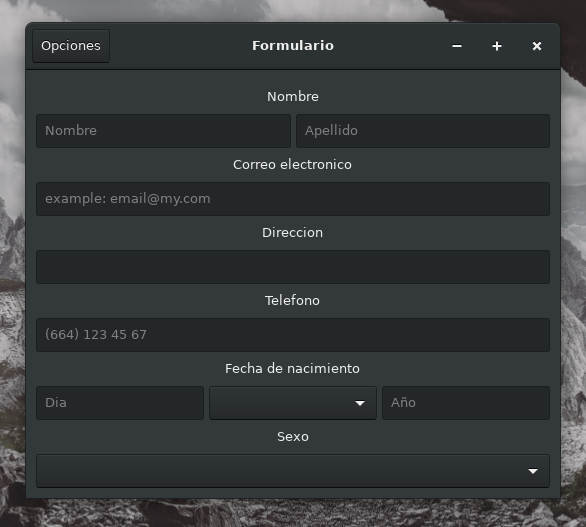

Formulario PDF GTK
=========================
**Description:** Formulario que registra datos de una persona y los guarda en un PDF

**License:** GNU General Public License v3.0

**Source code:** https://github.com/OrigenData/Formulario-PDF-GTK	

**Documentation:** https://www.origendata.com/

###### Screenshot

### Dependencies (Test on Fedora 28)

**Formulario PDF GTK** requiere que se instalen las siguientes librerias para ejecutar:
* GTK 3.20
* java-gnome 4.1.3
* itextpdf